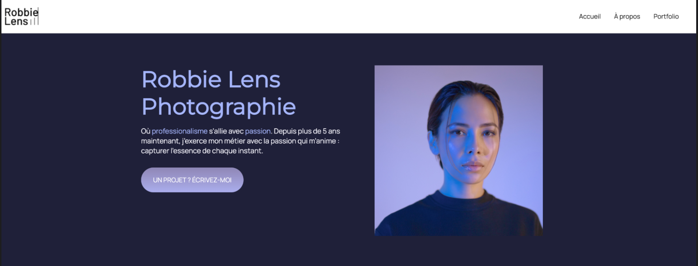

# Robbie Lens - Site Web Moderne en HTML & CSS

Ce projet est une reproduction d'un site web moderne de type portfolio pour photographe, entièrement réalisé avec **HTML** et **CSS**. Il met l'accent sur le **design responsive**, la **typographie soignée** et une **présentation professionnelle**.

## 🌐 Aperçu



## ✨ Fonctionnalités

- Mise en page moderne avec flexbox
- Palette de couleurs élégante
- Typographie harmonieuse
- Responsive design (adapté aux mobiles)
- Bouton d’appel à l’action
- Navigation simple : Accueil, À propos, Portfolio

## 🛠️ Technologies utilisées

- HTML5
- CSS3 (flexbox, variables CSS, animations)

## 🚀 Lancer le projet en local

1. Clone le dépôt :
   ```bash
   git clone https://github.com/tonpseudo/robbie-lens-site.git
